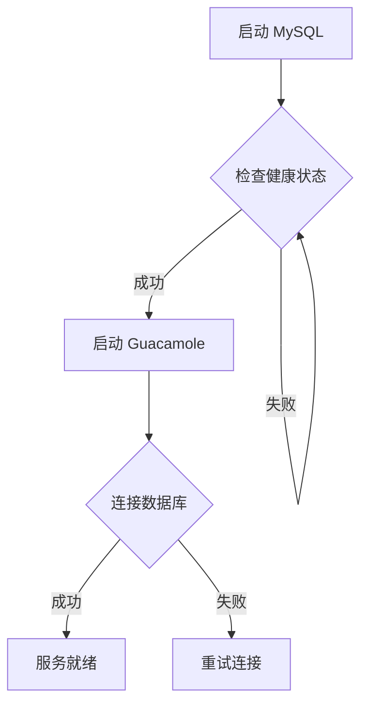

# Guacamole 自动初始化配置说明

## 更新内容

已更新 Docker Compose 配置，添加了以下自动初始化功能：

### 1. 数据库自动初始化
- ✅ 使用 MySQL 的 `/docker-entrypoint-initdb.d` 机制
- ✅ 首次部署时自动执行 `init.sql` 脚本
- ✅ 创建所有必需的数据库表和默认用户

### 2. 健康检查
- ✅ MySQL 服务健康检查
- ✅ Guacamole 等待 MySQL 健康后才启动

### 3. 文件结构
```
/root/
├── guacamole-docker-compose.yml      # 更新的配置文件
├── guacamole-docker-compose.yml.backup  # 原配置备份
└── init.sql                          # 数据库初始化脚本
```

## 部署步骤

### 方案 A：全新部署（推荐）
适用于首次部署或需要重新创建所有服务的情况。

```bash
# 1. 停止并删除现有容器
cd /root
docker-compose -f guacamole-docker-compose.yml down

# 2. 删除数据库数据（⚠️ 会清空所有配置和用户）
docker volume rm guacamole_mysql-data

# 3. 启动服务（自动初始化数据库）
docker-compose -f guacamole-docker-compose.yml up -d

# 4. 等待服务启动（约 30 秒）
docker-compose -f guacamole-docker-compose.yml logs -f

# 5. 验证
# 访问 http://76.13.219.143:8081/guacamole
# 使用默认账号登录：guacadmin/guacadmin
```

### 方案 B：平滑升级（当前环境）
适用于保留现有数据和配置的情况。

```bash
# 注意：由于数据库已经初始化，init.sql 不会重复执行
# MySQL 的 docker-entrypoint-initdb.d 只在数据库为空时运行

# 1. 备份数据库（可选但推荐）
docker exec guacamole-mysql mysqldump -u guacamole_user -pguacamole_password \
  guacamole_db > /root/guacamole-backup.sql

# 2. 停止服务
cd /root
docker-compose -f guacamole-docker-compose.yml down

# 3. 重新启动
docker-compose -f guacamole-docker-compose.yml up -d

# 4. 验证服务状态
docker-compose -f guacamole-docker-compose.yml ps
docker logs guacamole-web | tail -20
```

## 工作原理

### MySQL 初始化机制
MySQL 官方镜像的初始化流程：
1. 检查 `/var/lib/mysql` 目录是否为空
2. 如果为空，执行 `/docker-entrypoint-initdb.d/` 下的所有 SQL 脚本
3. 只在首次创建时执行，之后重启不会重复执行

### 健康检查流程


## 配置变更对比

### 原配置
```yaml
mysql:
  image: mysql:8.0
  # ... 无初始化配置
```

### 新配置
```yaml
mysql:
  image: mysql:8.0
  volumes:
    - ./init.sql:/docker-entrypoint-initdb.d/init.sql:ro  # 新增
  healthcheck:                                              # 新增
    test: ["CMD", "mysqladmin", "ping", "-h", "localhost", "-u", "root", "-prootpassword"]
    interval: 10s
    timeout: 5s
    retries: 5

guacamole:
  depends_on:
    mysql:
      condition: service_healthy  # 改进：等待健康检查
```

## 验证步骤

### 1. 检查容器状态
```bash
docker ps | grep guacamole
```

### 2. 检查数据库表
```bash
docker exec guacamole-mysql mysql -u guacamole_user -pguacamole_password \
  guacamole_db -e "SHOW TABLES;"
```

### 3. 检查默认用户
```bash
docker exec guacamole-mysql mysql -u guacamole_user -pguacamole_password \
  guacamole_db -e "SELECT * FROM guacamole_entity;"
```

### 4. 检查日志
```bash
docker logs guacamole-web | grep -i error
```

## 故障排除

### 问题：数据库初始化失败
```bash
# 查看日志
docker logs guacamole-mysql

# 手动执行初始化（如果自动初始化失败）
docker run --rm guacamole/guacamole:latest /opt/guacamole/bin/initdb.sh --mysql | \
  docker exec -i guacamole-mysql mysql -u guacamole_user -pguacamole_password guacamole_db
```

### 问题：Guacamole 无法连接数据库
```bash
# 检查网络
docker network inspect guacamole-net

# 测试连接
docker exec guacamole-web ping mysql
```

### 问题：恢复原始配置
```bash
cd /root
docker-compose -f guacamole-docker-compose.yml down
cp guacamole-docker-compose.yml.backup guacamole-docker-compose.yml
docker-compose -f guacamole-docker-compose.yml up -d
```

## 默认账号

- **用户名：** `guacadmin`
- **密码：** `guacadmin`

⚠️ **重要：首次登录后请立即修改密码！**

## 维护建议

1. **定期备份数据库**
   ```bash
   # 每周备份
   0 3 * * 0 docker exec guacamole-mysql mysqldump -u guacamole_user -pguacamole_password guacamole_db > /backup/guacamole-$(date +\%Y\%m\%d).sql
   ```

2. **监控磁盘空间**
   ```bash
   df -h /var/lib/docker/volumes/
   ```

3. **更新镜像**
   ```bash
   docker-compose -f guacamole-docker-compose.yml pull
   docker-compose -f guacamole-docker-compose.yml up -d
   ```

---

**更新时间：** 2026-03-03
**更新内容：** 添加自动初始化和健康检查功能
